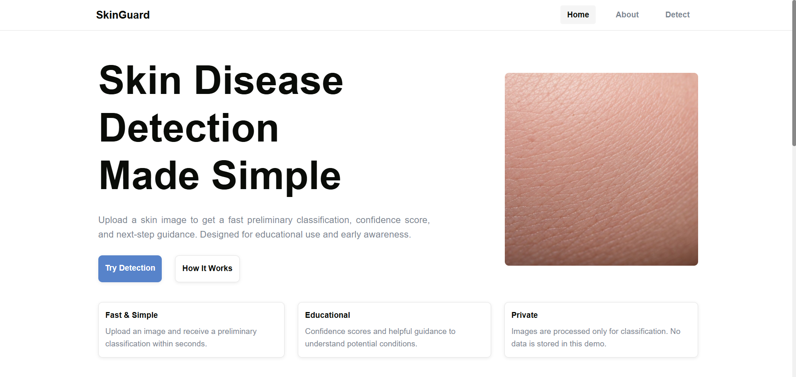
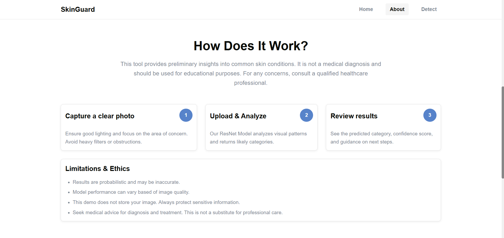
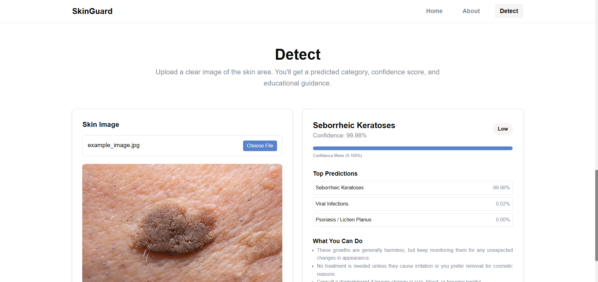

# 🩺 SkinGuard 

SkinGuard is an AI-powered skin disease detection system that helps users identify potential skin conditions from images. Using a Kaggle dataset of diverse skin disease images, the system leverages a deep learning model (ResNet) to classify skin lesions accurately and efficiently. SkinGuard delivers reliable predictions while maintaining a scalable pipeline for future model improvements.

## ✨ Technologies  

- Python  
- TensorFlow / Keras (ResNet Architecture)
- PIL (Image Preprocessing)

## 🚀 Features  

- AI-based skin disease detection with multi-class classification
- Pretrained ResNet model fine-tuned on Kaggle dataset
- Image preprocessing pipeline (resizing, normalization, augmentation)
- Clean visualization of predictions with confidence scores

## 📊 Dataset

- **Source:** [Kaggle Skin Diseases Image Dataset](https://www.kaggle.com/datasets/ismailpromus/skin-diseases-image-dataset/data)
- **Content:** A diverse collection of skin disease images across multiple categories, including conditions like eczema, warts, and melanoma.
- **Size:** Over 15,000 images, providing a comprehensive foundation for training deep learning models.
- **Preprocessing:** Images were resized, normalized, and augmented to enhance model generalization and performance.


## 🌠 The Process  

The goal of SkinGuard is to provide users with a reliable AI assistant for preliminary skin condition identification. The project pipeline includes image collection and preprocessing, training a ResNet-based convolutional neural network, and evaluating the model with metrics like accuracy, precision, and recall. Data augmentation and normalization techniques were applied to improve generalization. The final system outputs predictions along with confidence scores for user-friendly interpretation.

## ⚙️ Running the Project  

### 🤖 Download Pretrained Model

1. Download the pretrained SkinGuard model from [This Link](https://drive.google.com/file/d/10AAbQk7O8SwnRe5s3qrCX5LMewr7gGRS/view?usp=sharing).  
2. Place the model file in the `backend/` directory of the project.

### 💻 Run the Application

#### 1️⃣ Backend (Flask)  
```bash
cd src/backend
pip install -r requirements.txt
flask run
```

#### 2️⃣ Frontend (React) 
From the project root folder, run:
```bash
npm install
npm run dev
``` 

## 📸 Screenshots  

  
  
  

## 📝 License  

MIT License © 2025 Kenzie Junaidi